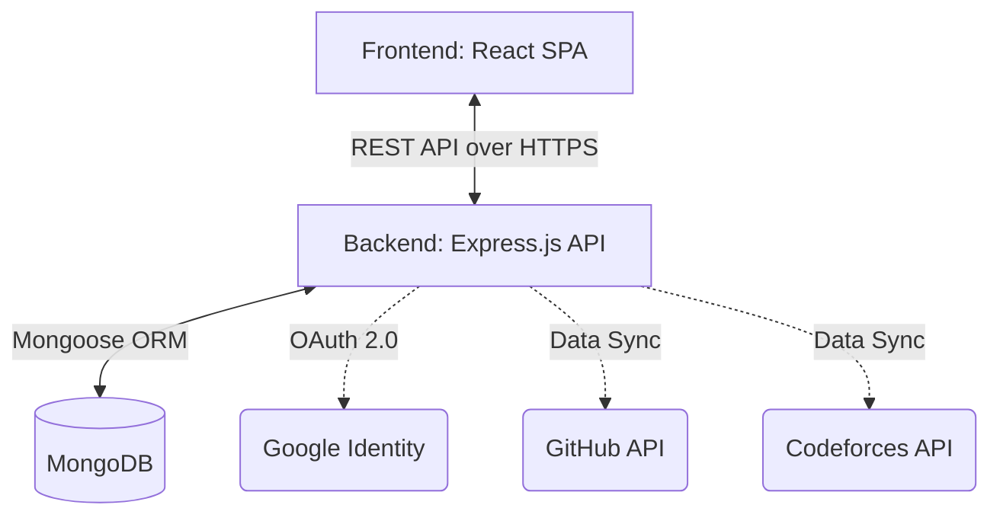

# CodeSphere 🌐

**CodeSphere** is a full-stack developer portfolio application that automatically aggregates, analyzes, and presents your statistics from **GitHub** and **Codeforces** into a unified, professional, and shareable public profile.

[](#)

---

## ✨ Features

- **OAuth 2.0 Authentication:** Secure login using Google Accounts, with JWT-based access and refresh token rotation.
- **GitHub Integration:** Fetches repository counts, stars, followers, following, and calculates an accurate language distribution (by bytes) across all repositories.
- **Codeforces Integration:** Fetches current rating, max rating, rank tiers, and visualizes rating progression over past contests via interactive charts.
- **Dynamic Dashboard:** View synchronized metrics through a modern, responsive UI featuring React Query for optimistic updates and caching.
- **Public Portfolio:** A polished, shareable public page (`/profile/:slug`) that consolidates your statistics. Includes privacy controls to restrict visibility.
- **Production Ready:** Built with security in mind (Helmet headers, global rate limiting, payload compression, and React Error Boundaries).

---

## 🛠 Tech Stack

### Frontend
- **React 19** (Vite)
- **Tailwind CSS 4**
- **React Router v7**
- **TanStack React Query** (Data fetching & caching)
- **Recharts** (Data visualization)
- **Axios** (API requests with automatic token refresh interceptors)

### Backend
- **Node.js & Express.js**
- **MongoDB & Mongoose**
- **JSON Web Tokens (JWT)** for session management
- **Security Middleware:** `helmet`, `express-rate-limit`, `cors`
- **Data Integration:** GitHub REST API, Codeforces API

---

## 🏗 Architecture



---

## 🚀 Local Installation & Setup

### 1. Prerequisites
- Node.js (v18+)
- MongoDB (Local instance or Atlas cluster)
- Google Cloud Console Project (for OAuth Credentials)

### 2. Clone the Repository
```bash
git clone https://github.com/mohdabid701148/CodeSphere.git
cd CodeSphere
```

### 3. Backend Setup
```bash
cd backend
npm install
```
Create a `.env` file in the `backend` directory:
```env
PORT=5000
MONGODB_URI=mongodb://localhost:27017/codesphere
ACCESS_TOKEN_SECRET=your_super_secret_access_key
ACCESS_TOKEN_EXPIRY=15m
REFRESH_TOKEN_SECRET=your_super_secret_refresh_key
REFRESH_TOKEN_EXPIRY=7d
GOOGLE_CLIENT_ID=your_google_client_id
GOOGLE_CLIENT_SECRET=your_google_client_secret
FRONTEND_URL=http://localhost:5173
MOCK_AUTH=false
NODE_ENV=development
```
Start the server:
```bash
npm run dev
```

### 4. Frontend Setup
```bash
cd frontend
npm install
```
Create a `.env` file in the `frontend` directory:
```env
VITE_API_URL=http://localhost:5000
```
Start the Vite dev server:
```bash
npm run dev
```

---

## 📦 Deployment Instructions

1. **Database:** Deploy MongoDB on **MongoDB Atlas**. Whitelist the production backend's IP address.
2. **Backend:** Deploy the Node.js application to **Render**, **Heroku**, or an **AWS EC2** instance. Ensure you set `NODE_ENV=production` and all other environment variables.
3. **Frontend:** Build the static assets using `npm run build` and deploy the `dist/` directory to **Vercel**, **Netlify**, or **AWS S3/CloudFront**. Update the `VITE_API_URL` to point to the production backend URL.

---

## 🔮 Future Improvements

- Add LeetCode and HackerRank integrations.
- Implement an Advanced Analytics phase (e.g., Codeforces problems solved, GitHub commit heatmaps).
- Add Markdown support for the developer bio.
- Implement caching via Redis for external API limits.

---

*Built for developers, by developers.* 🚀