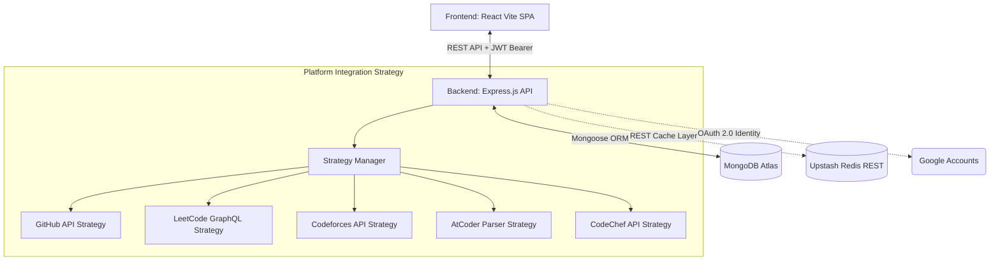

# CodeSphere 🌐

**CodeSphere** is a high-fidelity, production-grade developer portfolio aggregator and contest tracking platform. It automatically consolidates, synchronizes, and analyzes developer profiles and competitive programming statistics from **GitHub, LeetCode, Codeforces, AtCoder, and CodeChef** into a single, unified, and shareable public profile.

It features a sleek, premium dark/light layout inspired by standard SaaS platforms like Vercel, Linear, and Stripe, powered by interactive charting and a dynamic monthly coding consistency heatmap.

---

## ✨ Core Features

### 1. Unified Integrations Sync Engine
- **Strategy Pattern Architecture**: Built on a modular, decoupled strategy architecture (`BasePlatformStrategy`) allowing hot-swapping or adding new platform crawlers.
- **Auto-Sync / Cache**: Synchronizes coding submissions, contest ratings, solved problems counts, and rank levels.
- **Verification Protocols**: Verifies account ownership dynamically:
  - **LeetCode & Codeforces**: Verification via code submission matching.
  - **GitHub**: Verification via custom settings bio-token match.

### 2. Beautiful Visual Analytics & Dashboard
- **Rating Progression Charts**: Interactive graphs rendering rating histories over past contests using `Recharts`.
- **Coding Consistency Heatmap**: A custom GitHub/LeetCode style monthly contribution grid grouping submissions, calculating maximum streaks, and highlighting consistency colors.
- **Problem Solving Stats**: Side-by-side platform scorecard comparisons.

### 3. Contest Events Schedule Tracker
- **Aggregated Calendar**: Aggregates upcoming contest schedules from LeetCode, Codeforces, AtCoder, and CodeChef.
- **Local Timezone Conversions**: Standardizes start and end times dynamically to the user's browser timezone.
- **Calendar Exports**: Single-click "Add to Calendar" button generating Google Calendar invite links.
- **Search & Filters**: Instantly filters events by platform or search text query.

### 4. Company Kit
- **Interview Preparation**: Curated collection of standard DSA coding questions.
- **Platform & Company Filter**: Filters coding problems by target companies (e.g. Google, Amazon, Microsoft) and tags.
- **Difficulty Color Badging**: Easily highlights Easy, Medium, and Hard problem tags.

### 5. Onboarding & Profile Customization
- **Local Image Uploads**: Local profile photo uploading (handling base64 encoding with 2MB bounds-checking).
- **Public Portfolio URL**: Generates a shareable URL (`/profile/:slug`) containing public statistics.
- **Privacy Toggles**: Easily locks or reveals profiles/widgets.

---

## 🛠 Tech Stack

### Frontend (SPA Client)
- **Vite + React 19**
- **Tailwind CSS 4**
- **React Router v7** (Unified SPA Routing)
- **TanStack React Query** (Client cache state & data hydration)
- **Recharts** (Data visualization & progression lines)
- **Lucide React** (Consistent modern icon sets)
- **Axios** (With interceptors handling access token rotation & token refreshes)

### Backend (REST API Server)
- **Node.js & Express.js**
- **MongoDB & Mongoose** (NoSQL Database storage)
- **Upstash Redis REST API** (High-speed backend cache layer)
- **JSON Web Tokens (JWT)** (Secure token rotation session structure)
- **Security Middleware**: `helmet`, `express-rate-limit`, `cors`

---

## 🏗 Architecture & Flow Diagram

The diagram below details the MERN stack layout, OAuth login redirects, the integrations strategy engine, and the Redis cache layer:



---

## 🚀 Local Installation & Setup

### 1. Prerequisites
- Node.js (v18+)
- MongoDB (Local instance or MongoDB Atlas Connection URI)
- Google Cloud Console Project (for OAuth Credentials)

### 2. Clone the Repository
```bash
git clone https://github.com/mohdabid701148/CodeSphere.git
cd CodeSphere
```

### 3. Backend Setup
1. Navigate to the backend directory and install dependencies:
   ```bash
   cd backend
   npm install
   ```
2. Create a `.env` file in the `backend/` folder:
   ```env
   PORT=5000
   MONGODB_URI=mongodb://localhost:27017/codesphere
   ACCESS_TOKEN_SECRET=your_super_secret_access_jwt_string
   ACCESS_TOKEN_EXPIRY=15m
   REFRESH_TOKEN_SECRET=your_super_secret_refresh_jwt_string
   REFRESH_TOKEN_EXPIRY=7d
   FRONTEND_URL=http://localhost:5173
   GOOGLE_CLIENT_ID=your_google_client_id.apps.googleusercontent.com
   GOOGLE_CLIENT_SECRET=your_google_client_secret
   NODE_ENV=development
   # Optional Redis caching config
   UPSTASH_REDIS_REST_URL=your_upstash_redis_rest_url
   UPSTASH_REDIS_REST_TOKEN=your_upstash_redis_rest_token
   ```
3. Start the dev server:
   ```bash
   npm run dev
   ```

### 4. Frontend Setup
1. Navigate to the frontend directory and install dependencies:
   ```bash
   cd ../frontend
   npm install
   ```
2. Create a `.env` file in the `frontend/` folder:
   ```env
   VITE_API_URL=http://localhost:5000
   ```
3. Start the Vite development server:
   ```bash
   npm run dev
   ```

---

## 📦 Production Deployment Instructions

### Frontend (Hosted on Vercel)
Vercel hosts the static bundle out of the box:
1. Ensure the [vercel.json](file:///c:/Users/abidr/CodeSphere/frontend/vercel.json) rewrite file exists in your frontend folder:
   ```json
   {
     "rewrites": [
       { "source": "/(.*)", "destination": "/index.html" }
     ]
   }
   ```
2. Import the repository in Vercel.
3. Set the **Root Directory** to `frontend`.
4. Configure the Build Settings (Framework Preset: `Vite`, Output Directory: `dist`).
5. Add the environment variable:
   - `VITE_API_URL`: Your live Render backend URL (e.g. `https://codesphere-api.onrender.com`).

### Backend (Hosted on Render)
1. In Render, select **New** -> **Web Service**.
2. Set the **Root Directory** to `backend`.
3. Configure settings:
   - **Language**: `Node`
   - **Build Command**: `npm install`
   - **Start Command**: `npm start`
4. Add your `.env` keys in the **Environment Variables** panel. 
   - Make sure `FRONTEND_URL` is set to your live Vercel frontend URL to permit CORS requests.
   - Whitelist Render's IP addresses inside MongoDB Atlas database connection settings.

---

## 🛡 Security & Optimization Details

- **HTTP 431 Header Size Fix**: 
  - To prevent HTTP 431 errors on machines running other localhost sites with heavy cookies, the development start commands execute Node with `--max-http-header-size=24576` which allows up to 24KB headers.
  - Omitted base64 avatar payload strings from OAuth redirect query parameters (which bloated redirect URIs). Avatars are instead loaded dynamically on mount via JSON API.
- **Express Security**: Active Helmet protection, request compression, and global IP rate-limiting guards against brute-force calls.
- **Upstash Redis Caching**: Aggregated calendar schedules are cached to prevent IP-rate limits on external servers.